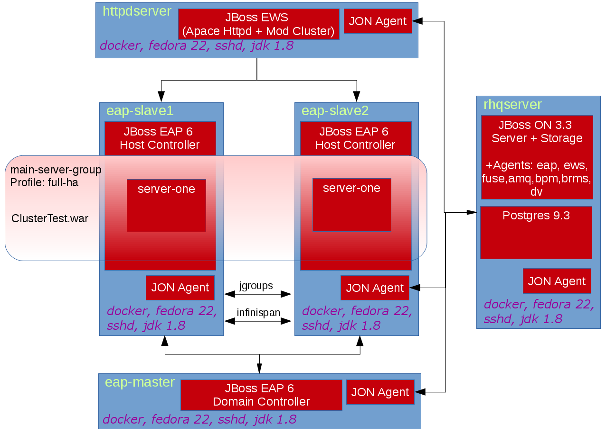

EAP Domain Mode, JON & Httpd Mod Cluster
=======

 This environment is designed to demonstrate EAP 6 Domain Operating mode with other complementary JBoss components. You can test EAP 6 in domain mode with two slave nodes, JON management & monitoring capabilities. An apache httpd server is also installed as a LoadBalancer, so you can also test mod_cluster capabilities as well.
 

## Prerequisites


Following images need to be in your local registry:

- [docker4jboss/eap6](../image-eap6/README.md)
- [docker4jboss/httpd-ews2](../image-httpd-ews2/README.md)
- [docker4jboss/postgres-9](../image-postgres-9/README.md)
- [docker4jboss/jon3-server](../image-jon3-server/README.md)

If you haven't done yet, please build this images first on your local server.
> All image binaries can be found in Red Hat's [internal registry](http:/docker-registry.usersys.redhat.com). If you're an RedHatter, you can download images from that repository instead of building locally.

```phensley/docker-dns ``` image is used as dns server in this demo. Pull it from docker hub

```bash
docker pull phensley/docker-dns
```

## How to run

   If everything is properly installed, the following command should be enough

```bash
  sh runDemo.sh
```
   If you have docker-compose installed on your system, you can alternatively start the demo containers with docker-compose:

```bash
  sh runComposer.sh
```

 Visit EAP master server  console ```http://eap-master:9990/console```, admin user name is ```admin``` and password is ```redhat1!```

  Mod cluster manager is accessible on ```http://httpdserver/mod_cluster-manager``` address. Visit and see how your slave nodes are controlled

JON server  initialization is taking some time, give it a couple of minute first and than visit ```http:///rhqserver:7080``` address to log into the console. ```rhqadmin``` can be used as user name and ```rhqadmin``` again as password. Check the discovery tool, all of your servers (except postgres one) should be discovered and waiting for you to import to your inventory.

JON Server (rhqserver) also has a postgres server installation which can be used as a generic database as well. POstgres server is exposed through port 5432, ```postgres``` user can be used to access it with ```postgres``` password.

  To stop and destroy demo containers:
```bash
sh destroyDemo.sh
```
  or
```bash
sh destroyComposer.sh
```


## EAP CLuster (Session Sharing) Demo

I've included a small cluster test application to demo. It's useful to demonstrate cluster & session sharing capabilities of EAP.
- You first need to deploy it :

```
# ssh root@eap-master
...
[root@eap-master ~]IPADDR=$(ip a s | sed -ne '/127.0.0.1/!{s/^[ \t]*inet[ \t]*\([0-9.]\+\)\/.*$/\1/p}')
[root@eap-master ~]/opt/jboss/eap/jboss-eap-6.4/bin/jboss-cli.sh --connect controller=$IPADDR --user=admin --password=redhat1! --command="deploy /eapConfig/deploy/ClusterTest.war --all-server-groups"
```

- If your deployment is successfully done, you can now access that application through httpd. First open EAP admin console and check if application is deployed. Secondly, open httpd mod_cluster manager on ```http://httpdserver/mod_cluster-manager``` address and see /ClusterTest context is automatically enabled on all of your virtual hosts (EAP slaves).  
- Open your browser and enter ```http://httpdserver/ClusterTest``` address to access test application. On the main screen you'll see which eap server that you connected to and a hit counter. Eachtime you refresh this page, you'll see that counter is increasing. If you like you can place a value into the session as well.
- Please note which EAP instance that you've connected. Go to EAP management console from another browser window and stop that instance. Simply goto "Domain" tab, hover your mouse on the server and click to stop. Now go back to test screen again and refresh the page one more time. You should see now, your server is changed but your session value and counter is preserved.

Enjoy!
